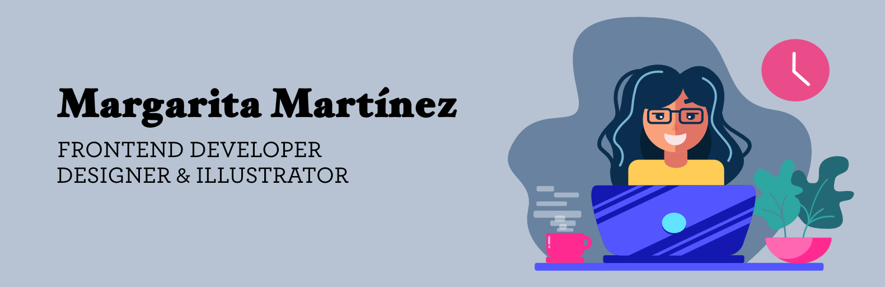

# Hola, soy Marga! 🤓👋🏻

Soy una diseñadora e ilustradora que empezó en esto de la programación tratando de animar mis personajes para un videojuego en 2016. Me quedé enganchada y he estado programando para la web desde entonces. En Septiembre de 2020 entre en el Bootcamp de adalab, para afianzar mis conocimientos, y trabajar en equipo con otras compañeras.

Las tecnologías que he aprendido son CSS, Javascript y React. Actualmente estoy a tope con redux.

Lo que más me gusta de la programación es lo mágico que es ver como una idea se transforma en un proyecto terminado. Mi superpoder es una personalidad dividida entre diseñadora y programadora, como Dos caras de Batman, aunque uso mis poderes para el bien 🙂

Actualmente estoy buscando empleo como frontend developer.

## Marga en la web 🌍
- Tengo una web con mis trabajos https://marga.pro
- Podéis encontrarme en [twitter](https://twitter.com/margamrt) y [LinkedIn](https://www.linkedin.com/in/margamarben/)

Tambien podeis ver alguno de mis proyectos aqui abajo ⬇

Si queréis ver mi proceso de trabajo he incluido un Readme en español e inglés en este proyecto, donde he hecho desde el diseño hasta el backend (y el front end claro 🙂).
https://github.com/margamb/calendar-test

<!--
**margamb/margamb** is a ✨ _special_ ✨ repository because its `README.md` (this file) appears on your GitHub profile.

Here are some ideas to get you started:

- 🔭 I’m currently working on ...
- 🌱 I’m currently learning ...
- 👯 I’m looking to collaborate on ...
- 🤔 I’m looking for help with ...
- 💬 Ask me about ...
- 📫 How to reach me: ...
- 😄 Pronouns: ...
- ⚡ Fun fact: ...
-->
